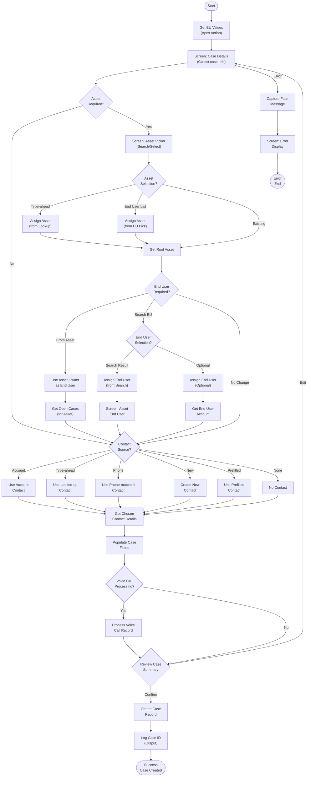

```mermaid
graph TD
    Start([Start]) --> GetBU["Get BU Values<br/>(Apex Action)"]
    GetBU --> CaseScreen["Screen: Case Details<br/>(Collect case info)"]
    
    CaseScreen --> Decision1{Asset<br/>Required?}
    
    Decision1 -->|No| ContactCheck
    Decision1 -->|Yes| AssetPicker["Screen: Asset Picker<br/>(Search/Select)"]
    
    AssetPicker --> AssetChoice{Asset<br/>Selection?}
    AssetChoice -->|Type-ahead| AssetLookup["Assign Asset<br/>(from Lookup)"]
    AssetChoice -->|End User List| AssetEU["Assign Asset<br/>(from EU Pick)"]
    AssetChoice -->|Existing| GetRootAsset["Get Root Asset"]
    
    AssetLookup --> GetRootAsset
    AssetEU --> GetRootAsset
    
    GetRootAsset --> Decision2{End User<br/>Required?}
    
    Decision2 -->|From Asset| UseOwner["Use Asset Owner<br/>as End User"]
    Decision2 -->|Search EU| EUSearch{End User<br/>Selection?}
    Decision2 -->|No Change| ContactCheck
    
    EUSearch -->|Search Result| AssignEU1["Assign End User<br/>(from Search)"]
    EUSearch -->|Optional| AssignEU2["Assign End User<br/>(Optional)"]
    
    UseOwner --> GetOpenCases["Get Open Cases<br/>(for Asset)"]
    AssignEU1 --> ScreenEU["Screen: Asset<br/>End User"]
    AssignEU2 --> GetEU["Get End User<br/>Account"]
    
    GetOpenCases --> ContactCheck
    ScreenEU --> ContactCheck
    GetEU --> ContactCheck
    
    ContactCheck{Contact<br/>Source?} -->|Account| AssignCont1["Use Account<br/>Contact"]
    ContactCheck -->|Type-ahead| AssignCont2["Use Looked-up<br/>Contact"]
    ContactCheck -->|Phone| AssignCont3["Use Phone-matched<br/>Contact"]
    ContactCheck -->|New| CreateContact["Create New<br/>Contact"]
    ContactCheck -->|Prefilled| AssignCont4["Use Prefilled<br/>Contact"]
    ContactCheck -->|None| NoContact["No Contact"]
    
    AssignCont1 --> GetContact["Get Chosen<br/>Contact Details"]
    AssignCont2 --> GetContact
    AssignCont3 --> GetContact
    CreateContact --> GetContact
    AssignCont4 --> GetContact
    NoContact --> GetContact
    
    GetContact --> PopulateFields["Populate Case<br/>Fields"]
    
    PopulateFields --> Decision3{Voice Call<br/>Processing?}
    
    Decision3 -->|Yes| ProcessVoice["Process Voice<br/>Call Record"]
    Decision3 -->|No| ReviewCase
    
    ProcessVoice --> ReviewCase{Review Case<br/>Summary}
    
    ReviewCase -->|Confirm| CreateCase["Create Case<br/>Record"]
    ReviewCase -->|Edit| CaseScreen
    
    CreateCase --> LogOutput["Log Case ID<br/>(Output)"]
    LogOutput --> Success([Success<br/>Case Created])
    
    CaseScreen -->|Error| FaultHandler["Capture Fault<br/>Message"]
    FaultHandler --> ErrorScreen["Screen: Error<br/>Display"]
    ErrorScreen --> End([Error<br/>End])

```
