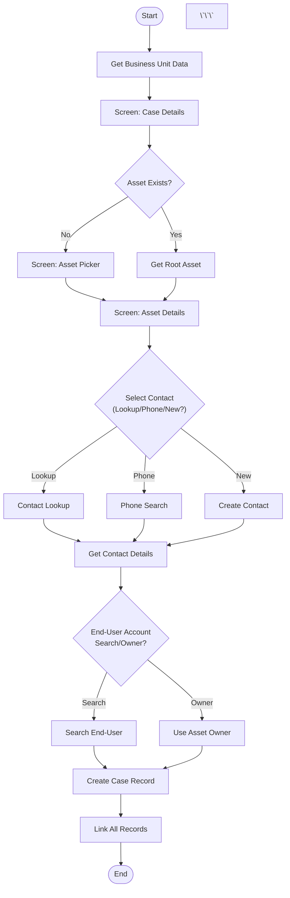

```mermaid
graph TD
    Start([Start]) --> GetBU["Get Business Unit Data"]
    GetBU --> CaseScreen["Screen: Case Details"]
    CaseScreen --> Decision1{Asset Exists?}
    Decision1 -->|No| AssetPicker["Screen: Asset Picker"]
    Decision1 -->|Yes| GetAsset["Get Root Asset"]
    AssetPicker --> AssetDetails["Screen: Asset Details"]
    GetAsset --> AssetDetails
    AssetDetails --> Decision2{"Select Contact<br/>(Lookup/Phone/New?)"}
    Decision2 -->|Lookup| ContactLookup["Contact Lookup"]
    Decision2 -->|Phone| PhoneSearch["Phone Search"]
    Decision2 -->|New| CreateContact["Create Contact"]
    ContactLookup --> GetContact["Get Contact Details"]
    PhoneSearch --> GetContact
    CreateContact --> GetContact
    GetContact --> Decision3{End-User Account<br/>Search/Owner?}
    Decision3 -->|Search| SearchEU["Search End-User"]
    Decision3 -->|Owner| UseOwner["Use Asset Owner"]
    SearchEU --> CreateCase["Create Case Record"]
    UseOwner --> CreateCase
    CreateCase --> LinkRecords["Link All Records"]
    LinkRecords --> End([End])
\`\`\`
```
