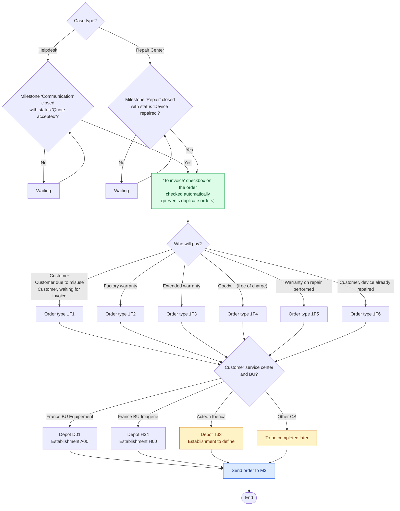

```mermaid
flowchart TD
    B{Case type?}

    B -->|Helpdesk| H1{"Milestone 'Communication' closed<br/>with status 'Quote accepted'?"}
    B -->|Repair Center| R1{"Milestone 'Repair' closed<br/>with status 'Device repaired'?"}

    H1 -->|No| HW[Waiting]
    R1 -->|No| RW[Waiting]
    HW --> H1
    RW --> R1

    H1 -->|Yes| T
    R1 -->|Yes| T

    T["'To invoice' checkbox on the order<br/>checked automatically<br/>(prevents duplicate orders)"] --> W{"Who will pay?"}

    W -->|"Customer<br/>Customer due to misuse<br/>Customer, waiting for invoice"| S1["Order type 1F1"]
    W -->|"Factory warranty"| S2["Order type 1F2"]
    W -->|"Extended warranty"| S3["Order type 1F3"]
    W -->|"Goodwill (free of charge)"| S4["Order type 1F4"]
    W -->|"Warranty on repair performed"| S5["Order type 1F5"]
    W -->|"Customer, device already repaired"| S6["Order type 1F6"]

    S1 & S2 & S3 & S4 & S5 & S6 --> CSC{"Customer service center<br/>and BU?"}

    CSC -->|"France BU Equipement"| D1["Depot D01<br/>Establishment A00"]
    CSC -->|"France BU Imagerie"| D2["Depot H34<br/>Establishment H00"]
    CSC -->|"Acteon Iberica"| D3["Depot T33<br/>Establishment to define"]
    CSC -->|"Other CS"| D4["To be completed later"]

    D1 & D2 & D3 --> M["Send order to M3"]
    D4 -.-> M
    M --> Z([End])

    classDef m3 fill:#dbeafe,stroke:#2563eb,color:#1e3a8a
    classDef guard fill:#dcfce7,stroke:#16a34a,color:#14532d
    classDef todo fill:#fef3c7,stroke:#d97706,color:#78350f
    class M m3
    class T guard
    class D3,D4 todo
```
